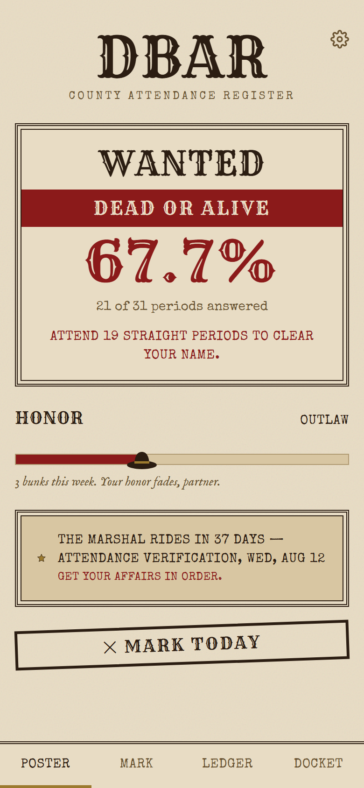
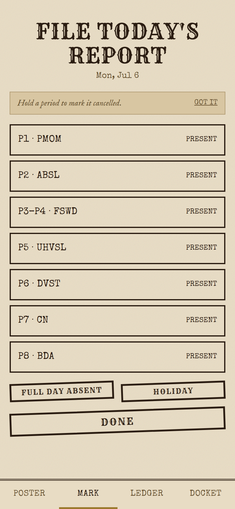
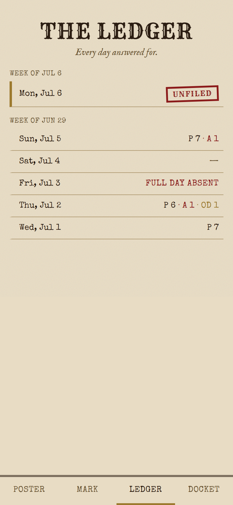

# DBar

A mobile-first attendance tracker for one college student, styled as a Red Dead
Redemption-style wanted poster. Your attendance percentage is your bounty;
fall below the cutoff and the poster turns red. It's a PWA — install it to
your home screen and it opens full-screen, no app store involved.

| Poster | Mark | Ledger |
| --- | --- | --- |
|  |  |  |

## What it does

- **Poster** (`/`) — today's attendance percentage as a wanted-poster status
  (Lawful Citizen → Wanted → Dead or Alive), an Honor meter that tracks a
  trailing 30-day trend, a countdown to the next official attendance
  verification date, and a one-tap "Mark Today" shortcut.
- **Mark** (`/mark/[date]`) — file a day's periods as Present/Absent/OD
  (tap to cycle, hold to mark a period cancelled), or shortcut the whole day
  as a holiday or full-day absence. Filing a day is idempotent and editable
  after the fact.
- **Ledger** (`/ledger`) — a week-by-week scrollback of every day since the
  semester started: filed, unfiled, holiday, or weekend.
- **Docket** (`/subjects`) — per-subject attendance breakdown across the
  semester.
- **Settings** (`/settings`) — identity/sign-out, your elective (AE / FSWD,
  cosmetic — it only changes what's *displayed*, the engine tracks both
  under one combined subject), your class ("outfit": join an existing one,
  forge a new one with a full Mon–Fri × 8-period timetable builder, or
  manage its holiday registry), and an "Add to Your Saddlebag" install
  prompt.

Offline support is intentionally bounded: a service worker precaches the app
shell and serves a themed offline page when a navigation fails outright, and
if filing a day fails from a real network error (not a validation error) it's
queued in `localStorage` and retried automatically once you're back online.

## Stack

- **Next.js 14** (App Router, Server Actions, TypeScript, strict mode)
- **MongoDB Atlas** via Mongoose (`User`, `Class`, `DayLog` models)
- **NextAuth v4** — Google OAuth only, JWT sessions
- **Tailwind CSS** — a small custom design system (`PosterFrame`, `Stamp`,
  `Heading`, `FlavorText`) rather than a component library
- **Vitest** for the engine/validation logic (attendance math, class-creation
  validation, elective display overrides — currently 90+ tests)
- Hand-rolled service worker (no `next-pwa`) + a generated icon set (`npm run
  icons`, via `sharp`) for installability

## Local setup

```bash
npm install
cp .env.local.example .env.local   # fill in the values below
npm run dev
```

| Variable | What it's for |
| --- | --- |
| `MONGODB_URI` | Atlas connection string — one database holds everything |
| `GOOGLE_CLIENT_ID` / `GOOGLE_CLIENT_SECRET` | Google OAuth credentials (Google Cloud Console) |
| `NEXTAUTH_SECRET` | Session encryption key — `openssl rand -base64 32` |
| `NEXTAUTH_URL` | The app's own base URL, e.g. `http://localhost:3000` |

First-time data setup:

```bash
npm run seed              # creates the one seeded class + its timetable
npm run assign-me -- you@example.com   # after your first Google sign-in, puts you in that class
```

## Scripts

| Command | Does |
| --- | --- |
| `npm run dev` | Local dev server |
| `npm run build` / `npm start` | Production build / serve (required to exercise the service worker — it's disabled under `next dev`) |
| `npm run lint` | ESLint |
| `npm test` | Vitest suite |
| `npm run icons` | Regenerates `public/icons/*` from `assets/icon.svg` |
| `npm run seed` | Seeds the one demo class |
| `npm run assign-me -- <email>` | Assigns a signed-in user to that class |

## Deploying

Built for Vercel. Set the four env vars above in the Vercel project settings
(with `NEXTAUTH_URL` pointing at the deployed domain), and add the
production callback URL
(`https://<your-domain>/api/auth/callback/google`) to the Google OAuth
client. The service worker and install prompt require HTTPS — Vercel
provides this by default; `localhost` is exempted for local dev.
